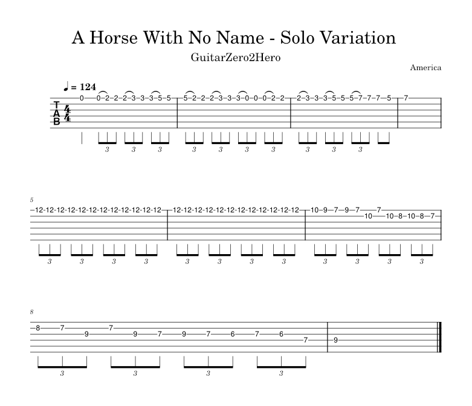
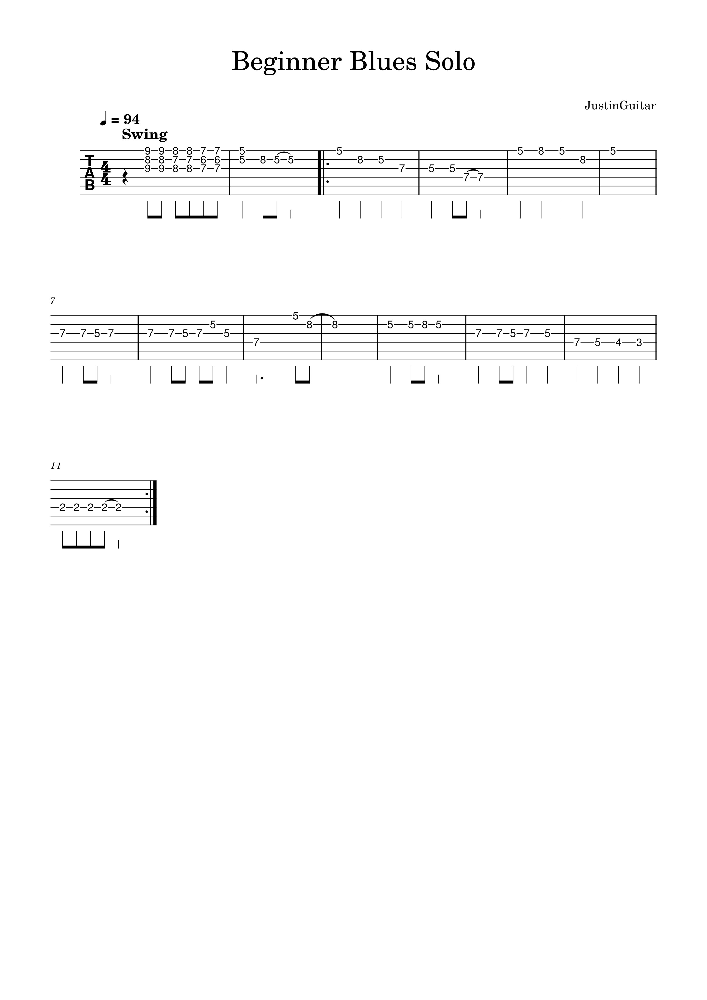
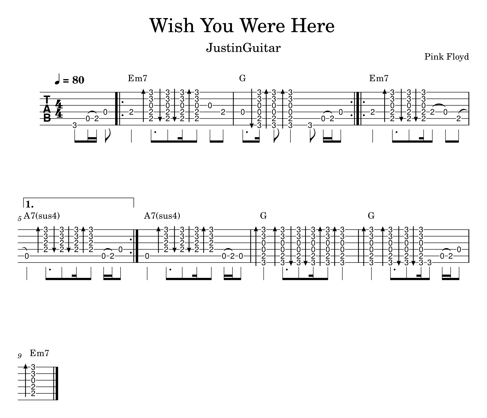
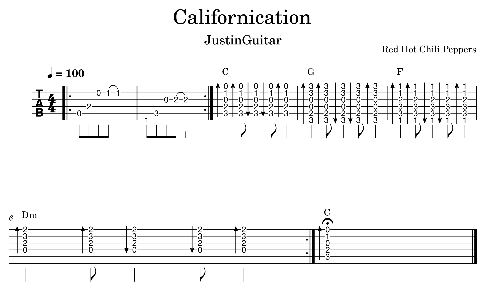
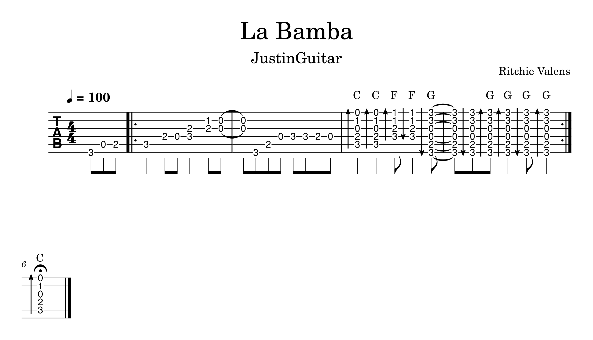
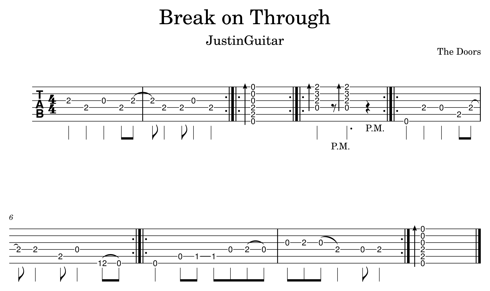
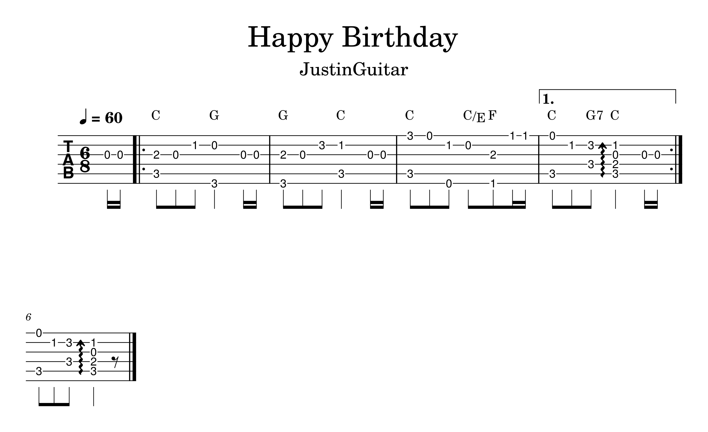
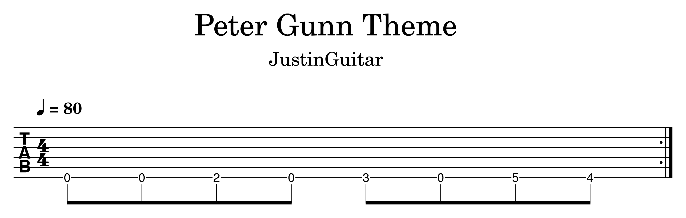
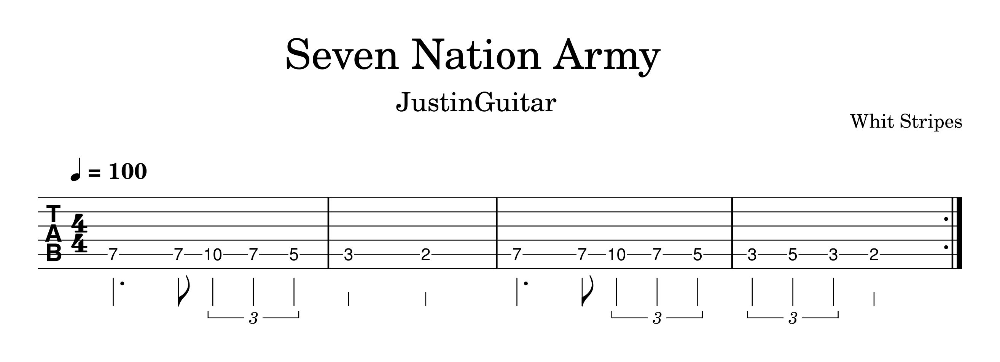

- [America - A Horse With No Name](https://www.guitarzero2hero.com/song/2555/a-horse-with-no-name-america-guitar-lesson) #song #1.0
  logseq.order-list-type:: number
  collapsed:: true
	- {{video https://youtu.be/TJIskQK0SpI}}
	- Key: Em
	- Tempo: 124bpm
	- Time Signature: 4/4 swing
	- Progression
	  collapsed:: true
		- Standard: ||: Em | Bm11/F# :||
			- ((670cf4f6-d495-41bc-b566-136589bf467e)) ((670cf4e7-64cc-4d86-9db5-c6f455deaccd))
		- Variation: ||: Em9 | F\#m7add11 Bm11 :||
			- ((670cf527-bbc0-4f45-8a50-f832ba0e091f)) ((670cf577-0ed9-45ff-8b94-766919c708d5)) ((670cf539-6683-44f7-a682-4d271dc30e09))
	- Strums
	  ```
	  1 + 2 + 3 + 4 +
	  
	  1st Bar
	  D   D U D U D U
	  
	  2nd Bar
	  D U X U D U D U
	  ```
	- Solo Variation
	  collapsed:: true
		- 
		- {:height 630, :width 731}
- [Bob Marley - Three Little Birds](https://www.justinguitar.com/songs/bob-marley-three-little-birds-chords-tabs-guitar-lesson-bs-101) #song #grade1
  logseq.order-list-type:: number
	- Time Signature: 4/4
	- Progression
		- Intro: ||: A | % :||
		- Chorus: ||: A | % | D | A :||
		- Verse: ||: A | E | A | D | A | E | D | A :||
		- Arrangement: || Chorus | Intro | Chorus | Verse ||
			- ((670cf6e0-03e8-40cd-9828-775d9d5348d5)) ((670cf740-73e9-4631-baf4-dd8bde5a6b99)) ((670cf6fa-42f9-4981-8799-10055dcd701c))
- [Dire Straits - Walk of Life](https://www.justinguitar.com/songs/dire-straits-walk-of-life-chords-tabs-guitar-lesson-bs-104) #song #grade1
  logseq.order-list-type:: number
	- Capo 7
	- Time Signature: 4/4
	- Progression
		- Intro: ||: E | A | B | A B :||
		- Verse: ||: E | % :||
		- Pre-Chorus: ||: A | E :||
		- Chorus: || E B | E A | E B | A B ||
		- Arrangement: || Intro | Verse | Pre-Chorus | Chorus | Intro ||
			- ((670cf890-5c10-48d4-800d-0e9d9dcc0463)) ((670cf8c3-f2a3-4b25-8c99-3535224d1c9a)) ((670cf85f-1d8e-4e36-b5d0-a96857643c22))
- [Elvis Presley - Hound Dog](https://www.justinguitar.com/songs/elvis-presley-hound-dog-chords-tabs-guitar-lesson-bs-103) #song #grade1
  logseq.order-list-type:: number
	- Time Signature: 4/4
	- Progression: ||: A | % | % | % | D | % | A | % | E | D | A | A - :||
		- ((670cf6e0-03e8-40cd-9828-775d9d5348d5)) ((670cf740-73e9-4631-baf4-dd8bde5a6b99)) ((670cf6fa-42f9-4981-8799-10055dcd701c))
- [Elvis Presley - I Can't Help Falling in Love with You](https://www.justinguitar.com/songs/elvis-presley-i-can-t-help-falling-in-love-with-you-chords-tabs-guitar-lesson-bs-604) #song #grade2
  logseq.order-list-type:: number
	- Capo: 2
	- Time Signature: 6/8
	- Progression
		- Intro: || D | A | D | D ||
		- Verse1: || D  | F\#m | Bm | Bm or Bm/A | F# | D | A | A or A7 | F# | A | Bm | F# ||
		- Verse2: || D | F\#m | C\#7 | F\#m | C\#7 | F\#m | C\#7 | F\#m | B7 | Em | A7 ||
		- Arrangement: || Intro | Verse1 | Intro | Verse2 ||
			- ((670cf9e7-4cd7-44f3-b0af-2e365ee24ec0)) ((670cfb74-f033-47ed-98b4-b919fe0f508f)) ((670cfc5c-6184-4096-946d-10a405e15ab5)) ((670cfa8e-9b33-4358-a175-8ecf443ed022)) ((670cfad2-cbe7-46a3-83b1-d79e99de96b9)) ((670cfbe2-2658-4bb4-8ae8-042af351abc1)) ((670cf837-0e07-4990-a0b2-5e775eaf2f13)) ((670cfc99-4bfa-4dfd-b6a6-5a492fe44a32)) ((670cfb28-1598-44d8-9c7b-00216d4c3e64)) ((670cfa43-fddb-4788-9426-7179e62398dc))
- [Green Day - Good Riddance (Time of Your Life)](https://www.justinguitar.com/songs/green-day-good-riddance-time-of-your-life-chords-tabs-guitar-lesson-sg-066) #song #grade2
  logseq.order-list-type:: number
	- Time Signature: 4/4
	- Progression: ||: G | G | Cadd9 | Dsus4/E :||: Em7 | Dsus4/E | Cadd9 | G :||: Em | G :|| Em7 | Dsus4/E | G ||
		- ((670cff09-97b6-4504-a73f-687354419c65)) ((670cffb6-259e-4974-adda-a4991841aa8e)) ((670cff88-304b-4762-8e2f-c0612a6e8e37)) ((670cfeb3-8026-4b5e-950e-fb747d9594c8))
	- Strums with little finger on string 1 to mute it.
	  ```
	  1 + 2 + 3 + 4 +
	  B   D 2   3 B 3
	  ```
- [John Mayall - All Your Love](https://www.justinguitar.com/songs/john-mayall-all-your-love-chords-tabs-guitar-lesson-sg-029) #song #grade1
  logseq.order-list-type:: number
	- Time Signature: 4/4, 4/4 swing
	- Progression:
		- Part: ||: Am | % :||: Dm :||: Am :|| Em | Dm || Am | Am - ||
		- Arrangement: || (4/4) Part (x3) || (4/4 swing) Part (x3) || Part ||
			- ((670d00cd-a0a9-4524-bdcc-218dd9be864f)) ((670d00f4-ea88-41de-bd14-1140bf88e34c)) ((670cf4f6-d495-41bc-b566-136589bf467e))
- [JustinGuitar - Beginner Blues Solo](https://www.justinguitar.com/guitar-lessons/beginner-blues-solo-bg-1304) #song #grade2
  logseq.order-list-type:: number
	- 
	- {:height 764, :width 936}
- [Metallica - Enter Sandman](https://www.justinguitar.com/guitar-lessons/enter-sandman-bg-1204) #riff #grade2
  logseq.order-list-type:: number
	- 
	  tempo:: 80
	- 
	  tempo:: 100
	- 
- [Neil Young - Cortez the Killer](https://www.justinguitar.com/songs/neil-young-cortez-the-killer-easy-chords-tabs-guitar-lesson-bs-290) #song #grade1
  logseq.order-list-type:: number
	- Time: 4/4
	- Progression: || Em | D ||: Am :||
		- ((670d00cd-a0a9-4524-bdcc-218dd9be864f)) ((670cf740-73e9-4631-baf4-dd8bde5a6b99)) ((670cf4f6-d495-41bc-b566-136589bf467e))
	- Strums
	  ```
	  1 + 2 + 3 + 4 +
	  D   D   D U D
	  
	  1 e + a 2 e + a 3 e + a 4 e + a
	  D H     D     U   U D     U D U
	  ```
- [Nirvana - Come as You Are](https://www.justinguitar.com/guitar-lessons/riff-come-as-you-are-b2-506) #riff #grade1
  logseq.order-list-type:: number
	- 
	  tempo:: 100
	- 
- [Pink Floyd - Wish You Were Here](https://www.justinguitar.com/guitar-lessons/wish-you-were-here-riff-for-beginners-b3-808) #riff #grade2
  logseq.order-list-type:: number
	- 
	  tempo:: 80
	- {:height 1050, :width 738}
		- ((670cff88-304b-4762-8e2f-c0612a6e8e37)) ((670d02a5-e34d-430b-87d0-e1ef542386c0)) ((670cfeb3-8026-4b5e-950e-fb747d9594c8))
- [Oasis - Wonderwall (Simplified)](https://www.justinguitar.com/songs/oasis-wonderwall-chords-tabs-guitar-lesson-bs-805) #song #grade2
  logseq.order-list-type:: number
	- Capo: 2
	- Time Signature: 4/4
	- Progression
		- Verse-Intro: ||: F\#m7 A | Esus4 B7sus4  :|| (x3)
		- Verse: || Dadd9 Esus4 | B7sus4 ||
		- Verse-Variation: || Dadd9 Esus4 | B7sus4 - ||
		- Bridge: ||: Dadd9 Esus4 | F\#m7 : || Dadd9 Esus4 | A Esus4/G# F\#m7 F\#m7 ||: B7sus4 :||
		- Chorus: ||: Dadd9 F\#m7 | A F\#m7 :|| (x4)
		- Arrangement: || Verse-Intro | Verse | Verse-Intro | Verse-Variation | Bridge | Chorus ||
			- ((670cf9e7-4cd7-44f3-b0af-2e365ee24ec0)) ((670d06a8-d821-416d-97c8-9c84fa271375)) ((670d06c7-36b1-430e-8f8e-36f7f2da180e)) ((670d05cf-7f9d-4b3e-8767-faed4f88e259)) ((670d092f-9107-49a5-a3a7-b5dea71a7bdc)) ((670d0656-576d-479c-81b2-1abf6e7b505c))
	- Strums
	  ```
	  1st Bar
	  1 e + a 2 e + a 3 e + a 4 e + a
	  D   D   D   D U D U D   D   D U
	                ^
	                Chord change
	  
	  2nd Bar
	  1 e + a 2 e + a 3 e + a 4 e + a
	  D U D   D   D U   U   U D U D U
	                ^             ^
	                |             Lift fingers 1&2
	                Chord change
	  ```
- [Pulp - Common People](https://www.justinguitar.com/songs/pulp-common-people-chords-tabs-guitar-lesson-bs-109) #song #grade1
  logseq.order-list-type:: number
	- Capo: 3
	- Time Signature: 4/4
	- Progression: ||: C % :||: G | % :||: C | % :||: G | % :||: F | % :||: C | % :|| G | % :||
		- ((670d7d7c-5fd6-4899-b6f1-7f3ca0a109b5)) ((670d7ddd-69b4-44b1-b7ab-51404bb0d6b7)) ((670d7e0a-4225-4fb5-bcd8-c0102e14d5c8))
- [Red Hot Chili Peppers - Californication](https://www.justinguitar.com/guitar-lessons/californication-riff-b3-908) #riff #grade2
  logseq.order-list-type:: number
	- 
	  tempo:: 100
	- {:height 449, :width 729}
- [Ritchie Valens - La Bamba](https://www.justinguitar.com/guitar-lessons/la-bamba-riff-bg-1008) #riff #grade2
  logseq.order-list-type:: number
	- 
	  tempo:: 100
	- {:height 401, :width 693}
- [The Animals - House of the Rising Sun](https://www.justinguitar.com/songs/the-animals-house-of-the-rising-sun-chords-tabs-guitar-lesson-bs-609#learn-more) #song #grade2
  logseq.order-list-type:: number
	- Time Signature: 6/8
	- Progression: ||: Am | C | D | F | Am | E | Am | E :||: Am | C | D | F | Am | C | E | E | Am | C | D | F | Am | E :|| Am ||
		- ((670d00cd-a0a9-4524-bdcc-218dd9be864f)) ((670d0af0-c9ab-4cf6-b2a8-9fd9159f87fe)) ((670cf740-73e9-4631-baf4-dd8bde5a6b99)) ((670cf6fa-42f9-4981-8799-10055dcd701c)) ((670d0b3f-9d81-44c2-8ff7-c31db6691826))
- [The Cranberries - Zombie](https://www.justinguitar.com/songs/the-cranberries-zombie-chords-tabs-guitar-lesson-sg-141) #song #grade1
  logseq.order-list-type:: number
	- Time Signature: 4/4
	- Progression: ||: Em | Em/C | Gadd13 | A9sus4/F# :|| or ||: E5 | C5 | G5 | G5/F# :||
		- ((670d0cde-5337-4866-b54b-13985385264b)) ((670d0af0-c9ab-4cf6-b2a8-9fd9159f87fe)) ((670d0df5-d5e1-48f2-93e4-c8c2c0154800)) ((670d0d8a-7751-4c5a-b530-fe73ffcf8109)) ((670cf4f6-d495-41bc-b566-136589bf467e)) ((670d0bbb-dad1-45d8-a3af-44c836d4d1d4)) ((670d0e22-2373-4d76-9069-193ae823d08a)) ((670d0e90-8fe5-4e96-820d-f20a50f4a230)) ((670d0c51-edd3-4650-b717-c50fe5a2106a))
	- Solo: ||: Em | Em | C | C :||
	- Strums
	  ```
	  1 + 2 + 3 + 4 +
	  S     D D D D
	  
	  1 + 2 + 3 + 4 +
	  D d d D d d D d
	  ```
- [The Doors - Break on Through](https://www.justinguitar.com/songs/the-doors-break-on-through-chords-tabs-guitar-lesson-sg-24) #song #grade2
  logseq.order-list-type:: number
	- 
	  tempo:: 120
	- {:height 485, :width 799}
- [The Weekend - Call Out My Name](https://www.justinguitar.com/songs/the-weeknd-call-out-my-name-chords-tabs-guitar-lesson-sg-26) #song #grade1
  logseq.order-list-type:: number
	- Time Signature: 6/8
	- Progression: ||: Am :||: Em :||
		- ((670d00cd-a0a9-4524-bdcc-218dd9be864f)) ((670cf4f6-d495-41bc-b566-136589bf467e))
- [Theme - Happy Birthday](https://www.justinguitar.com/guitar-lessons/happy-birthday-finger-style-bg-1105) #fingerstyle #grade2
  logseq.order-list-type:: number
	- 
	  tempo:: 60
	- {:height 477, :width 862}
- [Theme - Peter Gunn](https://www.justinguitar.com/guitar-lessons/peter-gunn-theme-b2-207) #riff #grade1
  logseq.order-list-type:: number
	- 
	  tempo:: 80
	- 
- [Theme - 12 Bar Blues](https://www.justinguitar.com/guitar-lessons/12-bar-blues-progressions-bg-1303) #song #grade2
  logseq.order-list-type:: number
	- Time Signature: 4/4 Swing
	- Progressions
		- Standard: || I I I I | IV IV I I | V IV I V ||
		- Quick: || I IV I I | IV IV I I | V IV I V ||
		- Slow Change: || I I I I | IV IV I I | V V I I ||
	- Keys
		- A: I = A7, IV = D7, V = E7
			- ((670d0fd7-24f9-476a-ab8f-244168880901)) ((670d0ff2-225e-4fde-bafd-98b81ef6bccd)) ((670cff88-304b-4762-8e2f-c0612a6e8e37))
		- E: I = E7, IV = A7, V = B7
			- ((670d0fd7-24f9-476a-ab8f-244168880901)) ((670d1047-0f52-4811-9f7e-10d311ceb4fa)) ((670d1027-22ce-40ee-8fbb-7a7e9b57fe97))
		- G: I = G7, IV = C7, V = D7
			- ((670d107e-0c42-45ea-9c4e-81fa862d61f3)) ((670d0ff2-225e-4fde-bafd-98b81ef6bccd)) ((670d1061-ebc4-4a0b-aa3f-dea8d7f09739))
- [Tom Waits - Chocolate Jesus](https://www.justinguitar.com/songs/tom-waits-chocolate-jesus-chords-tabs-guitar-lesson-bs-222) #song #grade1
  logseq.order-list-type:: number
	- Capo: 6
	- Time Signature: 4/4
	- Progression
		- Verse: || D\#m | % | % ||: G\#m :|| D\#m ||: A# :||
		- Chorus1: ||: D\#m | % | % | G\#m | % | D\#m | A# | D\#m :||
		- Chorus2: || D\#m | % | % | G\#m | % | D\#m | A# | D\#m ||
		- Bridge: || G\#m | % | % ||: D\#m :||: G\#m :|| A# | % | % ||
		- Arrangement: || Verse | Chorus1 | Bridge | Chorus2 ||
			- ((670d11f1-e9e8-4c63-a930-db6e0fc383e4)) ((670d116b-5d7c-4a93-a62a-5a86982c3493)) ((670d11af-e1ea-48ca-be98-49d7ffc7f92a))
	- Strums
	  ```
	  1 + 2 + 3 + 4 +
	  D   d u D   d u
	  B   d u B u d u
	  ```
- [White Stripes - Seven Nation Army](https://www.justinguitar.com/guitar-lessons/seven-nation-army-b2-309) #riff #grade1
  logseq.order-list-type:: number
	- 
	  tempo:: 100
	- 
- Templates
	- song-entry
	  template:: song-entry
	  template-including-parent:: false
		- [Artists - Title]()
			- Key:
			- Tempo:
			- Time Signature:
			- Progression
			- Strums
			  ```
			  ```