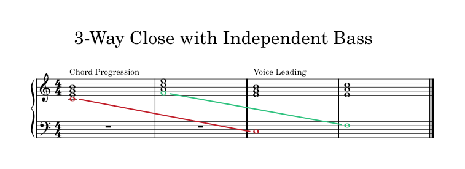
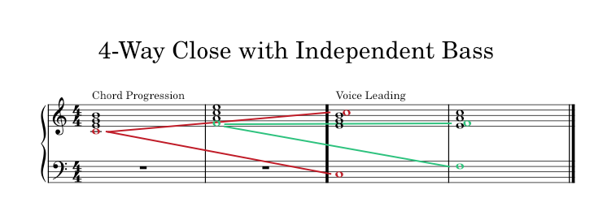

# 7th Chords
	- {{video https://youtu.be/DGcL9_tIjbk}}
	- ## What are 7th Chords?
		- We used the **add-skip** method to create 3-note chords called **triads**. We don't need to stop at 3-note chords. We can construct chords with more than 3 notes using the same **add-skip** method. The 4-note chords constructed in this manner are called **7th chords**. They're called **7th chords** because we add the 7th note of the scale and skipping the 6th.
	- ## Diatonic 7th Chords for Major & Minor Scales
	  id:: 66fef062-33f7-44fa-b0c4-37bbb0fb354d
		- Constructing the 4-note chords of the major & natural minor scales, starting on each of the available notes we get:
			- Major: `Imaj7` `ii-7` `iii-7` `IVmaj7` `V7` `vi-7` `vii-7(b5)`
			  id:: 66fef062-9645-42e9-ab27-a0c90e9726ab
			- Natural minor: `i-7` `ii-7(b5)` `IIImaj7` `iv-7` `v-7` (`V7`) `VImaj7` `VIImaj7`
			  id:: 66fef062-1c59-409f-b57c-1bc21a27ac6d
		- There are 4 types of diatonic 7th chords that occur in the major & minor scales:
			- major triad + major 3rd = major 7th. E.g. `Imaj7`, `VImaj7`.
			  logseq.order-list-type:: number
			- minor triad + minor 3rd = minor 7th. E.g. `ii-7`, `iv-7`.
			  logseq.order-list-type:: number
			- major triad + minor 3rd = dominant 7th. E.g. `V7`.
			  logseq.order-list-type:: number
			- diminished triad + minor 3rd = minor 7(b5). E.g. `vii-7(b5)`.
			  logseq.order-list-type:: number
	- ## 7th Chords & Functional Harmony
		- It doesn't. The 7th chords maintain the same tonic/subdominant/dominant functions as the triads. Thus, the same patterns can be used to create chord progressions.
	- ## 7th Chords & Voice Leading
		- If you're going to work with 7th chords, you have two different options for voice leading.
			- 
			  id:: 66fef062-1ca2-4168-b5c5-b4891fca511c
			  collapsed:: true
				- Useful for chord progressions that use both triads and 7th chords.
				- Move the 7th chord root to the bass line.
				- Voice lead the remaining 3-notes as if they were stand-alone triads.
			- 
				- Useful for chord progressions that use only 7th chords.
				- Copy your roots to create the bass line.
				- Voice lead as usual.
	- ## Exercises
		- **Writing 7th chords.** Pick three different notes and write their respective #major-scale and **parallel** #natural-minor-scale. Use the **add-skip** method to write the diatonic 7th chords. Don't forget to add the `V7` chord to the #natural-minor-scales.
		  logseq.order-list-type:: number
			- #major-scale
			  
			  ||1|2|3|4|5|6|7|
			  |--|--|--|--|--|--|--|--|
			  |1|**E**|F#|G#|A|B|C#|D#|
			  |2|**Ab**|Bb|C|Db|Eb|F|G|
			  |3|**G**|A|B|C|D|E|F#|
			  
			  |||||||||
			  |--|--|--|--|--|--|--|--|
			  || `Imaj7`| `ii-7`| `iii-7`| `IVmaj7`| `V7`| `vi-7`| `vii-7(b5)`|
			  || T | S | T | S | D | T | S |
			  |1|E-G\#-B-D#|F\#-A-C\#-E|G\#-B-D\#-F#|A-C\#-E-G#|B-D\#-F\#-A|C\#-E-G\#-B|D\#-F\#-A-C#|
			  |2|Ab-C-Eb-G|Bb-Db-F-Ab|C-Eb-G-Bb|Db-F-Ab-C|Eb-G-Bb-Db|F-Ab-C-Eb|G-Bb-Db-F|
			  |3|G-B-D-F#|A-C-E-G|B-D-F\#-A|C-E-G-B|D-F\#-A-C|E-G-B-D|F\#-A-C-E|
			- **parallel** #natural-minor-scale
			  
			  ||1|2|3|4|5|6|7|
			  |--|--|--|--|--|--|--|--|
			  |1|**E**|F#|G|A|B|C|D|
			  |2|**G#**|A#|B|C#|D#|E|F#|
			  |3|**G**|A|Bb|C|D|Eb|F|
			  
			  ||`i-7`|`ii-7(b5)`|`IIImaj7`|`iv-7`|`v-7`|(`V7`)|`VImaj7`|`VIImaj7`|
			  |--|--|--|--|--|--|--|--|--|
			  ||T|S|T|S|S|D|T|S|
			  |1|E-G-B-D|F\#-A-C-E|G-B-D-F#|A-C-E-G|B-D-F\#-A|B-D\#-F\#-A|C-E-G-B|D-F\#-A-C|
			  |2|G\#-B-D\#-F#|A\#-C\#-E-G#|B-D\#-F\#-A#|C\#-E-G\#-B|D\#-F\#-A\#-C#|D\#-F-A\#-C#|E-G\#-B-D#|F\#-A\#-C\#-E|
			  |3|G-Bb-D-F|A-C-Eb-G|Bb-D-F-A|C-Eb-G-Bb|D-F-A-C|D-F\#-A-C|Eb-G-A-D|F-A-C-Eb|
		- **Writing chord progressions.** Use either the **strong-weak** or **T-S-D-T** pattern to create a chord progression in each of your 6 keys.
		  logseq.order-list-type:: number
			- #major-scale
			  ||**Scale**|**Progression**||||||
			  |--|--|--|--|--|--|--|--|
			  |1|**E**|`Imaj7`|`IVmaj7`|`vi-7`|`IVmaj7`|`Imaj7 V7`|`Imaj7`|
			  |2|**Ab**|`Imaj7`|`ii-7 vii-7(b5)`|`iii-7`|`ii-7`|`V7`|`Imaj7`|
			  |3|**G**|`iii-7`|`vii-7(b5)`|`vi-7`|`IVmaj7`|`ii-7 V7`|`iii-7`|
			- #natural-minor-scale
			  ||**Scale**|**Progression**|||||||
			  |--|--|--|--|--|--|--|--|--|
			  |1|**E**|`IIImaj7`|`iv-7 v-7`|`IIImaj7`|`v-7`|`VImaj7`|`V7`|`i-7`|
			  |2|**G#**|`VImaj7 i-7`|`iv-7`|`IIImaj7`|`VIImaj7`|`i-7`|`v-7`|`i-7`|
			  |3|**G**|`VImaj7`|`ii-7(b5) v-7`|`i-7`|`iv-7`|`IIImaj7`|`VIIImaj7`|`i-7`|
		- **Voice leading.** Voice lead each of the 6 chord progressions. Make sure to use the **3-Way Close with Independent Bass** for half and **4-Way Close with Independent Bass** for the other half.
		  logseq.order-list-type:: number